# Lecture 01 - Systems of Linear Equations

> [!abstract] Summary
> A preliminary lecture: what a system of linear equations is, how to write it as $AX = B$, the three possible outcomes (unique, infinitely many, none), homogeneous vs non-homogeneous systems, and a first look at echelon form, pivots and free variables. The first five lectures are the foundation for everything up to the midterm. Course logistics are in [Course Overview](../Course%20Overview.md).

## 1. Linear equation and system

A linear equation has variables with power 1 only. Slope-intercept form is $y = mx + c$ and the standard form is

$$ax + by = c$$

> [!note] Definition
> A **system of linear equations** is a list of linear equations with the same unknowns.

A system with two equations in two unknowns:

$$\begin{aligned}
a_{11}x + a_{12}y &= b_1 \\
a_{21}x + a_{22}y &= b_2
\end{aligned}$$

It is called a $2 \times 2$ system because its coefficient matrix has 2 rows and 2 columns.

## 2. Matrix form $AX = B$

$$A = \begin{bmatrix} a_{11} & a_{12} \\ a_{21} & a_{22} \end{bmatrix}, \qquad X = \begin{bmatrix} x \\ y \end{bmatrix}, \qquad B = \begin{bmatrix} b_1 \\ b_2 \end{bmatrix}$$

| Matrix | Name | Built from |
|---|---|---|
| $A$ | Coefficient matrix | coefficients of the unknowns |
| $X$ | Variable matrix | the unknowns |
| $B$ | Constant matrix | right-hand side constants |

Short form of the system:

$$AX = B$$

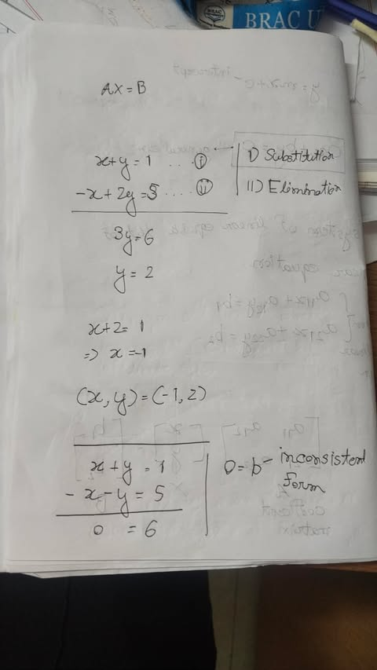

## 3. Solving a small system (the school methods)

Two familiar methods: **substitution** and **elimination** (Cramer's rule also works, but it is an application of determinants and was skipped).

> [!example] Example: unique solution
> $$\begin{aligned} x + y &= 1 \quad \text{(i)} \\ -x + 2y &= 5 \quad \text{(ii)} \end{aligned}$$
> Add (i) and (ii): $3y = 6 \Rightarrow y = 2$. Put $y = 2$ in (i): $x + 2 = 1 \Rightarrow x = -1$.
> $$(x, y) = (-1, 2)$$

> [!example] Example: no solution
> $$\begin{aligned} x + y &= 1 \\ -x - y &= 5 \end{aligned}$$
> Adding gives $0 = 6$, which is impossible. This is the **inconsistent form** $0 = b$ with $b \neq 0$.

> [!warning] Note
> In class the instructor first wrote $-x + 2y = 3$, then changed it on the fly to $5$ so that $3y = 6$ works out. The notebook has $5$, so these notes use $5$.

## 4. Bigger systems need better methods

$$\begin{aligned}
x + y + z &= 1 \\
2x + 3y + 4z &= 2 \\
3x + 9y + 7z &= 3
\end{aligned}
\qquad
A = \begin{bmatrix} 1 & 1 & 1 \\ 2 & 3 & 4 \\ 3 & 9 & 7 \end{bmatrix}$$

This is a $3 \times 3$ system (size of the coefficient matrix). A $4 \times 4$ system (and $4 \times 5$, $5 \times 4$, $5 \times 5$ are all common in exams):

$$\begin{aligned}
x + y + z + 4t &= -1 \\
2x + 3y + 4z + 9t &= 2 \\
3x + 9y + 7z + 11t &= 3 \\
-x - 7y + 9z - 13t &= 4
\end{aligned}$$

Substitution and elimination by hand do not scale, so the course teaches two systematic methods:

1. **Gaussian elimination** = reduce to **Row Echelon Form (REF)**
2. **Gauss-Jordan elimination** = reduce to **Reduced Row Echelon Form (RREF)**

(The second name in each pair is the "nickname".) Both are taught from the next class. These two methods carry the whole course up to the midterm.

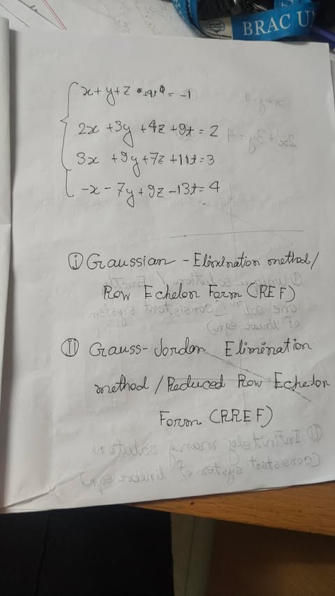

## 5. Types of solution

Seen graphically for two lines in the plane:

| Picture | Meaning | System type |
|---|---|---|
| 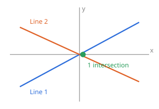 | Lines meet at exactly one point: **unique solution** | Consistent |
| 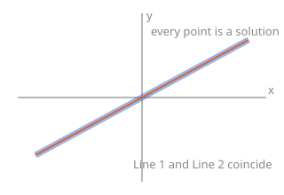 | Lines coincide: **infinitely many solutions** | Consistent |
| 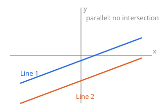 | Parallel lines, no meeting point: **no solution** | Inconsistent |

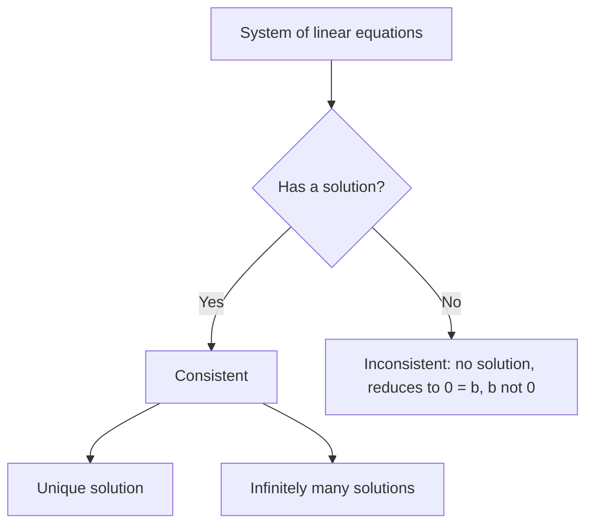

> [!note] Definition
> A system is **consistent** if it has a unique solution or more than one solution. If it has no solution it is **inconsistent**.

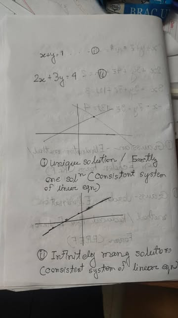
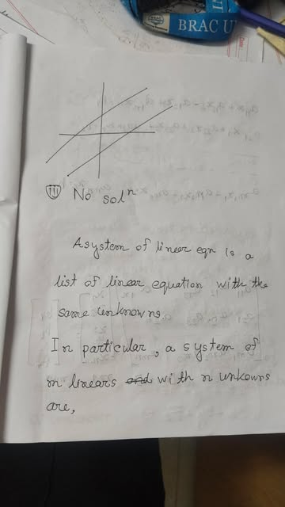

## 6. The general $m \times n$ system

A system of $m$ linear equations in $n$ unknowns:

$$\begin{aligned}
a_{11}x_1 + a_{12}x_2 + \dots + a_{1n}x_n &= b_1 \\
a_{21}x_1 + a_{22}x_2 + \dots + a_{2n}x_n &= b_2 \\
&\;\;\vdots \\
a_{m1}x_1 + a_{m2}x_2 + \dots + a_{mn}x_n &= b_m
\end{aligned}$$

$$\underbrace{\begin{bmatrix}
a_{11} & a_{12} & \dots & a_{1n} \\
a_{21} & a_{22} & \dots & a_{2n} \\
\vdots & \vdots & \ddots & \vdots \\
a_{m1} & a_{m2} & \dots & a_{mn}
\end{bmatrix}}_{A:\; m \times n}
\underbrace{\begin{bmatrix} x_1 \\ x_2 \\ \vdots \\ x_n \end{bmatrix}}_{X:\; n \times 1}
=
\underbrace{\begin{bmatrix} b_1 \\ b_2 \\ \vdots \\ b_m \end{bmatrix}}_{B:\; m \times 1}$$

Rows come first, then columns. Compact form:

$$\sum_{j=1}^{n} a_{ij}x_j = b_i, \qquad i = 1, 2, \dots, m$$

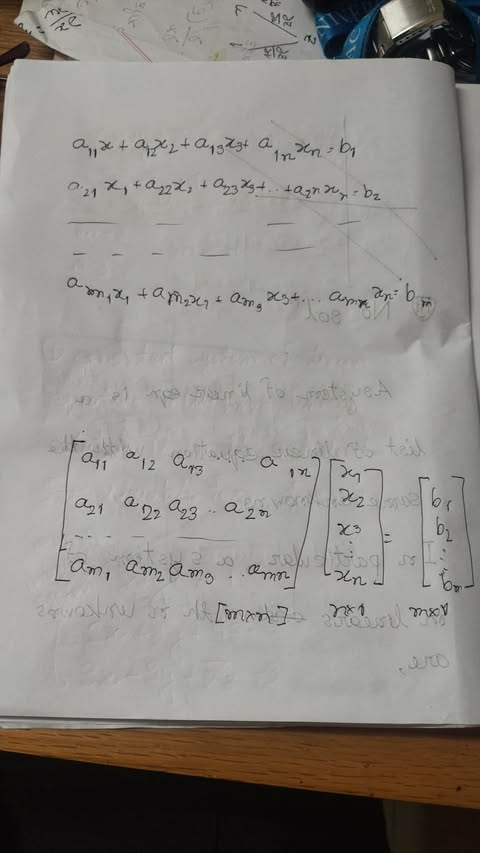

## 7. Homogeneous and non-homogeneous systems

- **Non-homogeneous:** at least one constant $b_i$ is non-zero.
- **Homogeneous:** every $b_i = 0$, i.e. the right-hand side is completely zero.

$$\begin{aligned} x + y + z &= 1 \\ 2x + 3y + 4z &= 0 \\ -x + 5y + 9z &= 0 \end{aligned}$$

This one is **non-homogeneous** (the first constant is $1$).

Most homogeneous systems give only the **zero (trivial) solution**:

$$(x_1, x_2, \dots, x_n) = (0, 0, \dots, 0)$$

> [!warning] Zero solution is not "no solution"
> The zero solution is a real solution, just like $1, 2, 3$. "No solution" means nothing satisfies the system. So **every homogeneous system is consistent**.

> [!important] Non-trivial solution condition
> A homogeneous system has a non-trivial solution (and then infinitely many) if the number of equations is less than the number of unknowns:
> $$m < n$$

> [!example] Example
> $$\begin{aligned} x + y + z &= 0 \\ 2x + 3y + 4z &= 0 \end{aligned} \qquad m = 2,\; n = 3,\; m < n$$
> So it has a non-trivial solution. How to find it comes next class.

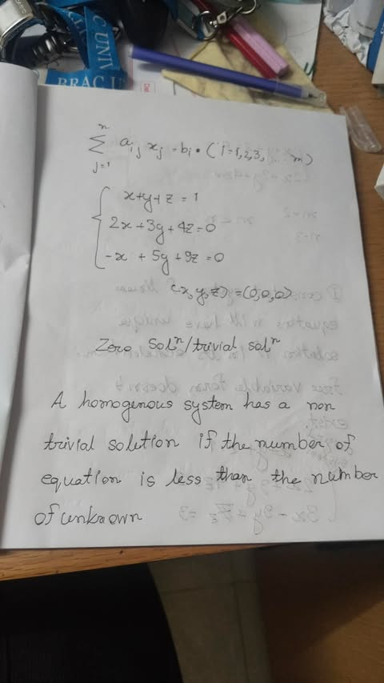
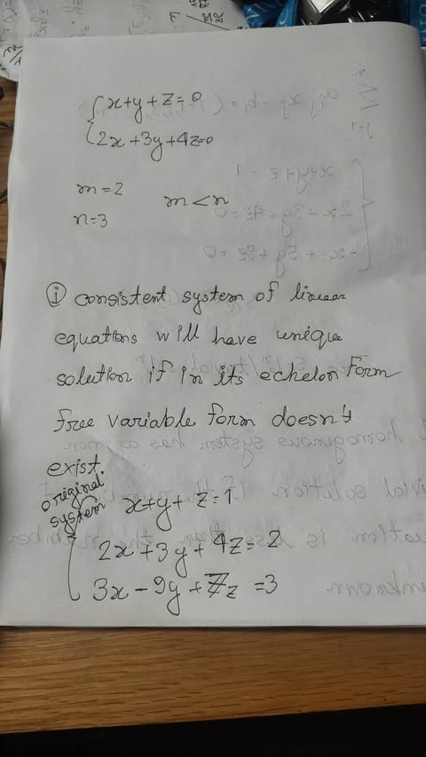

## 8. Echelon form, pivots and free variables (first look)

**Echelon form** is a modified form of the system. It is not given, it is obtained by applying row operations (details next class).

In echelon form, the first variable in each equation is a **pivot variable**. Any variable that is not a pivot is a **free variable**.

> [!important] Unique solution
> A consistent system has a **unique solution** if, in its echelon form, **no free variable exists**.

> [!important] Infinitely many solutions
> A consistent system has **infinitely many solutions** if, in its echelon form, **a free variable exists**.

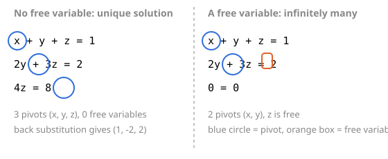

**Unique solution example** (3 equations, 3 pivots, back substitution from the bottom):

$$\begin{aligned} x + y + z &= 1 \\ 2y + 3z &= 2 \\ 4z &= 8 \end{aligned}$$

- $4z = 8 \Rightarrow z = 2$
- $2y + 3(2) = 2 \Rightarrow y = -2$
- $x + (-2) + 2 = 1 \Rightarrow x = 1$

$$(x, y, z) = (1, -2, 2)$$

**Free variable example:** the last equation vanishes ($0 = 0$), so only $x$ and $y$ get pivots and $z$ is free, giving infinitely many solutions.

**Inconsistent:** the last equation becomes $0 = b$ with $b \neq 0$. No solution.

> [!note] Definition: degenerate equation
> A linear equation is **degenerate** if all its coefficients are zero:
> $$0x_1 + 0x_2 + \dots + 0x_n = b$$
> If $b \neq 0$ the system has no solution (inconsistent); if $b = 0$ it is just $0 = 0$.

The notebook's own echelon example (page below) is $x + y + z = 1,\; y + 2z = 2,\; z = 3$, which back-substitutes to $(x, y, z) = (2, -4, 3)$.

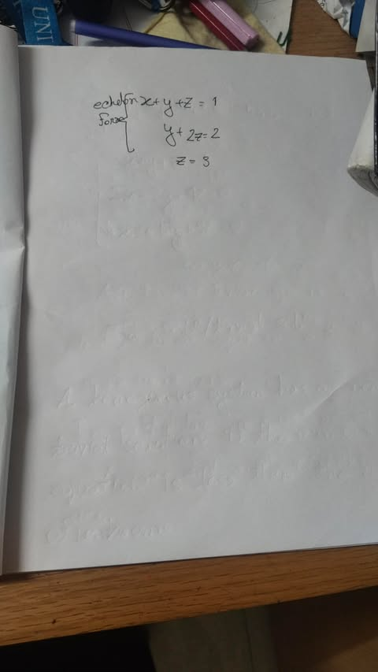

## Possible exam concept questions

The instructor said Question 1 (10 marks, compulsory) is conceptual: true/false, yes/no, MCQ or half-line definitions. Topics flagged in this lecture:

- [ ] Is a homogeneous system consistent? (Yes, always.)
- [ ] When does a homogeneous system have a non-trivial solution? ($m < n$)
- [ ] Zero solution vs no solution.
- [ ] Unique solution vs free variable in echelon form.
- [ ] What is a degenerate equation / the form $0 = b$?
- [ ] Size of $A$, $X$, $B$ for an $m \times n$ system.

## Open items

> [!question] To confirm
> 1. The photo of the 3-variable "original system" reads $3x - 9y + 7z = 3$, while the transcript (and the 4x4 photo) have $+9y$. Check the board version.
> 2. The notebook echelon example ($y + 2z = 2$, $z = 3$) does not come from row-reducing that original system exactly (R2 - 2R1 would give $y + 2z = 0$). It looks like a standalone illustration; check with the teacher or the uploaded lecture file.
> 3. The lecture date is an assumption (2026-10-05).

## Next class

Echelon form definition, then **Gaussian elimination** in detail with problem solving.

Related: [Course Overview](../Course%20Overview.md), [Formula Sheet](../Formula%20Sheet.md), [INDEX](../INDEX.md)
