# Lecture 02 — Gaussian Elimination and Back Substitution

> [!abstract] Summary
> A system is turned into **echelon form** using only three **row operations** on its augmented matrix. The echelon form tells us whether there is no solution, one solution or infinitely many, and **back substitution** (bottom to top) finishes the job.

## 1. Recap from Lecture 1

- A system of linear equations is **consistent** (has a solution) or **inconsistent** (has none).
- A consistent system has either a **unique** solution or **infinitely many**.
- Inconsistent: the echelon form contains a degenerate equation $0 = b$ with $b \neq 0$.
- A linear system gives exactly one of: no solution, one solution, infinitely many. Never both unique and infinite.

> [!example] Non-linear systems behave differently
> $x^2 = 1,\; x + y = 2$ is **not** linear (it has a power). It has two distinct solutions, $(1, 1)$ and $(-1, 3)$. This cannot happen for a linear system.

## 2. Echelon form

> [!note] Definition
> A system is in echelon form if
> 1. no equation is degenerate ($0 = b$), and
> 2. the leading unknown of each equation, other than the first, is to the **right** of the leading unknown of the preceding equation.

- Think of a line: someone has to stand first, so the first equation is exempt.
- "To the right" does not mean adjacent. The next leading unknown can be 1, 3 or 50 columns over, but never in the same column or to the left.
- Variables keep their order ($x, y, z$ or $x_1, x_2, \dots$) in every equation.

Example (echelon form):

$$
\begin{aligned}
x_1 + 6x_2 - x_3 + 4x_4 - 2x_5 &= 7 \\
x_3 + 2x_4 + 2x_5 &= 5 \\
x_4 - 9x_5 &= 6
\end{aligned}
$$

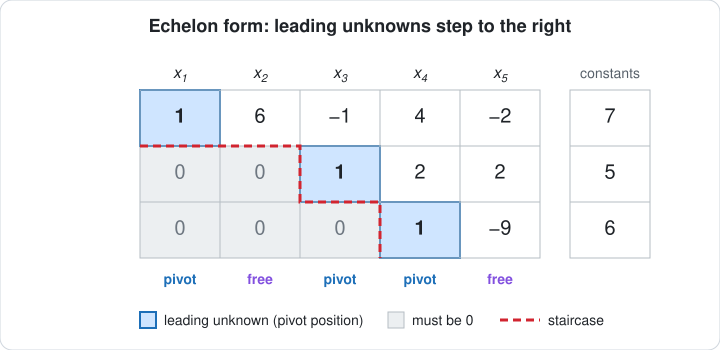

- **Pivot variables** are the leading unknowns: $x_1, x_3, x_4$.
- **Free variables** are all the others: $x_2, x_5$.
- Picture 5 students and 3 chairs: the 3 who sit get pivot positions, the other 2 are free.
- **Below a pivot, only zeros.** Nothing else is allowed there.

## 3. Reading the solution type from echelon form

| Echelon form shows | Conclusion |
| --- | --- |
| number of pivot variables = number of variables (no free variable) | **Unique** solution |
| number of variables > number of pivot variables (free variables) | **Infinitely many** solutions |
| a degenerate equation $0 = b$, $b \neq 0$ | **No** solution |

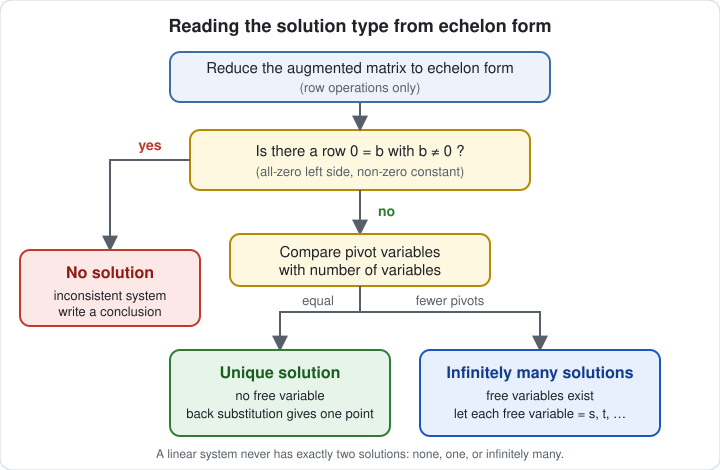

- The zero row appears by itself during calculation. You cannot force it.
- Unique solution example (back substitution works from the bottom up):

$$
\begin{aligned}
x + y + z &= 1 \\
y + z &= 2 \\
z &= 3
\end{aligned}
\;\Rightarrow\; z = 3,\quad y = 2 - 3 = -1,\quad x = 1 - (-1) - 3 = -1
$$

So $(x, y, z) = (-1, -1, 3)$, a single point.

## 4. Coefficient matrix vs augmented matrix

For

$$
\begin{aligned}
x + 2y + z &= 2 \\
3x + 8y + z &= 12 \\
4y + z &= 2
\end{aligned}
$$

- **Coefficient matrix** (only the coefficients of the variables):

$$
\begin{bmatrix} 1 & 2 & 1 \\ 3 & 8 & 1 \\ 0 & 4 & 1 \end{bmatrix}
$$

- **Augmented matrix** (add a vertical bar and the constants on the right):

$$
\left[\begin{array}{ccc|c} 1 & 2 & 1 & 2 \\ 3 & 8 & 1 & 12 \\ 0 & 4 & 1 & 2 \end{array}\right]
$$

> [!tip] First step of every problem
> Whenever a question says "use Gaussian elimination", the first job is to write the augmented matrix.

## 5. Row operations

Rows are named $R_1, R_2, R_3, \dots$ and $R_i'$ means the **new** version of row $i$. Only **row** operations are allowed. Column operations are banned.

| # | Rule | Notation | Example |
| --- | --- | --- | --- |
| 1 | Multiply a row by a non-zero constant | $R_2' = 2R_2$ | $[3,\,8,\,1 \mid 12] \to [6,\,16,\,2 \mid 24]$ |
| 2 | Interchange two rows | $R_2 \leftrightarrow R_3$ | rows 2 and 3 swap places |
| 3 | Add or subtract a multiple of one row to another | $R_2' = R_2 - 3R_1$ | $[3,\,8,\,1 \mid 12] - 3[1,\,2,\,1 \mid 2] = [0,\,2,\,-2 \mid 6]$ |

Nothing outside these three rules is allowed.

- You target one entry (e.g. turn the 3 into a 0), but the operation is applied to the **whole row**.
- Constants can be negative or fractions: $-3R_2$, $\tfrac{7}{2}R_2$.
- Use **fractions, not decimals**: write $\tfrac{7}{2}$ not $3.5$, and $\tfrac{3}{2}$ not $1.5$. Fractions are easier to check and to turn into 1 later.
- The multiple can be 1: $R_2' = R_2 + R_1$ turns $[-1,\,2,\,5]$ into $[0,\,4,\,8]$ when $R_1 = [1,\,2,\,3]$.
- Two operations can be written together in one step.

> [!warning] Not allowed
> - Subtracting a bare number from an entry (e.g. "$-3$" to make a 0). Use a multiple of a row.
> - Multiplying two rows together (e.g. $R_1' = R_1 \cdot R_3$).

## 6. Pivot positions and the shape of the matrix

- A **pivot position** is a location that holds a leading 1 in the echelon form of $A$. The entry there is a **pivot element**.
- A column with a pivot element is a **pivot column**; otherwise it is a **non-pivot column**.
- A row of all zeros must be at the **bottom**. Swap it down, shifting the rows below it up.

$$
\left[\begin{array}{ccc|c} 1 & 2 & 3 & 1 \\ 0 & 0 & 0 & 0 \\ 0 & 2 & 5 & 6 \end{array}\right]
\;\longrightarrow\;
\left[\begin{array}{ccc|c} 1 & 2 & 3 & 1 \\ 0 & 2 & 5 & 6 \\ 0 & 0 & 0 & 0 \end{array}\right]
$$

- The first non-zero entry of each row is a **leading 1**, and each leading 1 is to the right of the leading 1 above it.
- In Section 2 the pivots could be any non-zero number. In Gaussian elimination we normalise each pivot to 1 and make everything below it 0.

## 7. Gaussian elimination

**Goal:** an **upper triangular** matrix (zeros below the diagonal).

$$
\begin{bmatrix} a_{11} & a_{12} & a_{13} \\ a_{21} & a_{22} & a_{23} \\ a_{31} & a_{32} & a_{33} \end{bmatrix}
\;\longrightarrow\;
\begin{bmatrix} a_{11} & a_{12} & a_{13} \\ 0 & a_{22} & a_{23} \\ 0 & 0 & a_{33} \end{bmatrix}
$$

**Procedure**

1. Write the augmented matrix.
2. Is the first leading entry 1? If not, make it 1 first (see 7.1).
3. **Clear column 1:** make every entry below that 1 equal to 0 (rule 3).
4. Find the second leading entry, make it 1, then make the entries **below it** 0.
5. Repeat for each further pivot. Move any all-zero row to the bottom.
6. Write the equations back from the matrix and **back substitute** from the bottom up.

> [!important] Clear below a pivot using the pivot's own row
> To zero the entry under the second pivot, use $R_3' = R_3 - 4R_2$, not $R_1$. Using $R_1$ would make the entry in column 1 of row 3 non-zero again and undo earlier work.

> [!note] Gaussian vs Gauss–Jordan
> Gaussian elimination is flexible: you may turn a pivot into 1 before or after clearing below it. Gauss–Jordan is strict and makes you finish each column before moving on. Gauss–Jordan comes in a later class.

### 7.1 Getting a 1 in the top-left

The first entry cannot be 0 and must become 1. Example:

$$
\left[\begin{array}{ccc|c} 0 & 4 & 2 & 3 \\ 2 & 5 & 6 & 7 \\ 1 & 2 & 3 & 9 \end{array}\right]
$$

- **Swap $R_1 \leftrightarrow R_3$** (fastest): the 1 is already there.

$$
\left[\begin{array}{ccc|c} 1 & 2 & 3 & 9 \\ 2 & 5 & 6 & 7 \\ 0 & 4 & 2 & 3 \end{array}\right]
$$

- **Swap $R_1 \leftrightarrow R_2$** is also valid (same marks in an exam), but the top entry is now 2, so it needs one more step:
  - Method A, divide: $R_1' = \tfrac{1}{2}R_1$ gives $\left[1,\ \tfrac{5}{2},\ 3 \mid \tfrac{7}{2}\right]$. This brings in fractions.
  - Method B, subtract: $R_1' = R_1 - R_3$ gives $[1,\ 3,\ 3 \mid -2]$. This stays in integers.

> [!tip] Prefer integers
> Fractions are where mistakes happen. If a nearby row lets you reach 1 by adding or subtracting, do that. If the first entry is 0, swap with the nearest row that gives a non-zero entry. Speed comes only from practice.

## 8. Worked example (unique solution)

Solve by Gaussian elimination and back substitution:

$$
\begin{aligned}
x + 2y + z &= 2 \\
3x + 8y + z &= 12 \\
4y + z &= 2
\end{aligned}
$$

Start. The first leading entry is already 1.

$$
\left[\begin{array}{ccc|c} 1 & 2 & 1 & 2 \\ 3 & 8 & 1 & 12 \\ 0 & 4 & 1 & 2 \end{array}\right]
$$

**Clear column 1:** $R_2' = R_2 - 3R_1$ (row 3 already has 0).

$$
\left[\begin{array}{ccc|c} 1 & 2 & 1 & 2 \\ 0 & 2 & -2 & 6 \\ 0 & 4 & 1 & 2 \end{array}\right]
$$

**Second pivot to 1:** $R_2' = \tfrac{1}{2}R_2$ (every entry 2, −2, 6 divides cleanly).

$$
\left[\begin{array}{ccc|c} 1 & 2 & 1 & 2 \\ 0 & 1 & -1 & 3 \\ 0 & 4 & 1 & 2 \end{array}\right]
$$

**Clear below the second pivot:** $R_3' = R_3 - 4R_2$.

$$
\left[\begin{array}{ccc|c} 1 & 2 & 1 & 2 \\ 0 & 1 & -1 & 3 \\ 0 & 0 & 5 & -10 \end{array}\right]
$$

**Third pivot to 1:** $R_3' = \tfrac{1}{5}R_3$.

$$
\left[\begin{array}{ccc|c} 1 & 2 & 1 & 2 \\ 0 & 1 & -1 & 3 \\ 0 & 0 & 1 & -2 \end{array}\right]
$$

**Back substitution.** Read the equations off the matrix:

$$
\begin{aligned}
x + 2y + z &= 2 \\
y - z &= 3 \\
z &= -2
\end{aligned}
$$

$$
y - (-2) = 3 \Rightarrow y = 1, \qquad x + 2(1) + (-2) = 2 \Rightarrow x = 2
$$

$$
(x, y, z) = (2,\, 1,\, -2)
$$

This is **one** solution: a single point $(x, y, z)$, not three solutions.

## 9. Case 2: a zero row, so a free variable

Suppose elimination ends with

$$
\left[\begin{array}{ccc|c} 1 & 2 & 1 & 2 \\ 0 & 1 & -1 & 3 \\ 0 & 0 & 0 & 0 \end{array}\right]
$$

- 3 variables, 2 pivots, so $z$ is a **free variable**: the last equation vanished.
- A free variable is still part of the solution. It cannot be ignored (like a naughty child, still part of the family).
- **Let $z = t$**, $t \in \mathbb{R}$, and back substitute:

$$
y - t = 3 \Rightarrow y = 3 + t
$$

$$
x + 2(3 + t) + t = 2 \Rightarrow x + 6 + 3t = 2 \Rightarrow x = -4 - 3t
$$

General solution:

$$
(x, y, z) = (-4 - 3t,\; 3 + t,\; t)
$$

- $t = 0$ gives $(-4, 3, 0)$ and $t = 1$ gives $(-7, 4, 1)$. Each $t$ gives a different solution, so there are infinitely many.
- In column form this is $\begin{pmatrix} x \\ y \\ z \end{pmatrix} = \begin{pmatrix} -4 \\ 3 \\ 0 \end{pmatrix} + t \begin{pmatrix} -3 \\ 1 \\ 1 \end{pmatrix}$ (rewritten from the line above).
- **Naming parameters:** with several free variables use $s, t$ (what books use), then $p, q, r$ if needed. Avoid $\alpha, \beta$ (usually constants) and $x_1, x_2$ (those are the variables).

## 10. Case 3: inconsistent system

If elimination ends with

$$
\left[\begin{array}{ccc|c} 1 & 2 & 1 & 2 \\ 0 & 1 & -1 & 3 \\ 0 & 0 & 0 & 5 \end{array}\right]
$$

the last row says $0 = 5$.

$$
\begin{aligned}
x + 2y + z &= 2 \\
y - z &= 3 \\
0 &= 5
\end{aligned}
$$

- The row $0 = 5$ **cannot be dropped**. It is part of the system and it is impossible.
- Always finish with a conclusion sentence: *"The above system is inconsistent, so we will get no solution for the system."*

## Teacher materials and clarifications

- [[Gaussian Elimination - Teacher Materials|Instructor PDFs and page guide]]
- [[Gaussian Elimination - Worked Examples and Practice|Two worked examples and three practice questions]]
- [[Elementary Matrices and Inverses - Supplement|Elementary matrices and inverses — supplementary reading]]

> [!note] Reading the handout alongside these notes
> A pivot in row echelon form may be any nonzero value; making it 1 is a useful normalisation. Echelon form means pivots step to the right, zeros lie below each pivot, and all-zero rows are at the bottom. A contradictory augmented row can still occur in echelon form and signals no solution. Always check consistency first; only a consistent system with free variables has infinitely many solutions. Upper triangular form describes the square example here; the general goal is row echelon form, including rectangular systems.

## Next class

More practice problems, then **Gauss–Jordan elimination**. Course materials go up on Google Classroom.

## Open items

- [ ] **Back-substitution example in Section 3.** The board line was transcribed as $x - y + z = 1$, but the answer $x = -1$ only works with $x + y + z = 1$ (as written above). Check against your class notes. That reduced form is also an illustration only: the 3×3 system on the board actually reduces to $(1, 0, 0)$.
- [ ] **Non-linear example in Section 1.** In class the spoken solutions were $(-1, 2)$ and $(3, -2)$, which do not satisfy $x^2 = 1,\ x + y = 2$. The note uses the correct ones, $(1, 1)$ and $(-1, 3)$.
- [ ] **Coefficient matrix.** The teacher said it is built from the constants; this is a slip, corrected in Section 4.
- [ ] **Handwritten page 9:** the second entry of the general solution is hard to read ("3t" or "3 + t"). The note uses $3 + t$, matching the transcript.
- [ ] **Date and number** are assumed (Lecture 02, 2026-10-07). Fix the filename and `date` if the real class date differs.

## Handwritten notes

Page 1: leading-unknown rule and the problem statement.
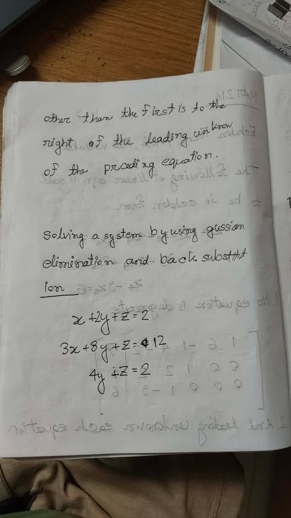

Page 2: augmented matrix, the three row operations, $R_2' = 2R_2$.
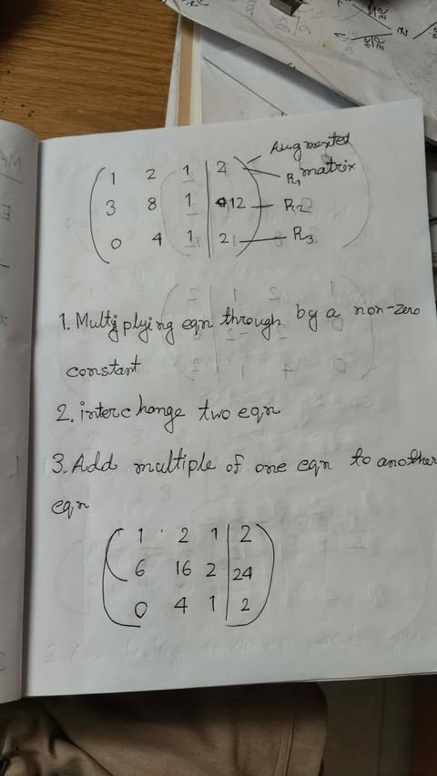

Page 3: result of $R_2' = R_2 - 3R_1$ (the reversed ink is bleed-through from the other side).
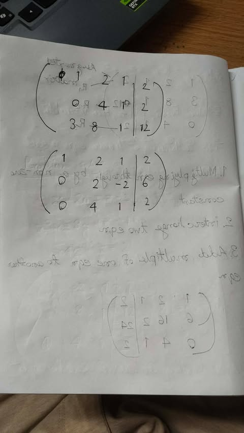

Page 4: swapping rows to get a leading 1, and $R_1' = \tfrac{1}{2}R_1$.
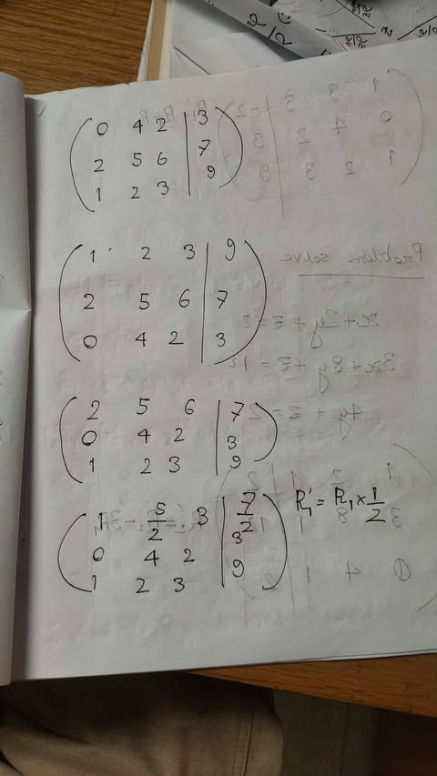

Page 5: $R_1' = R_1 - R_3$, then the problem set-up.
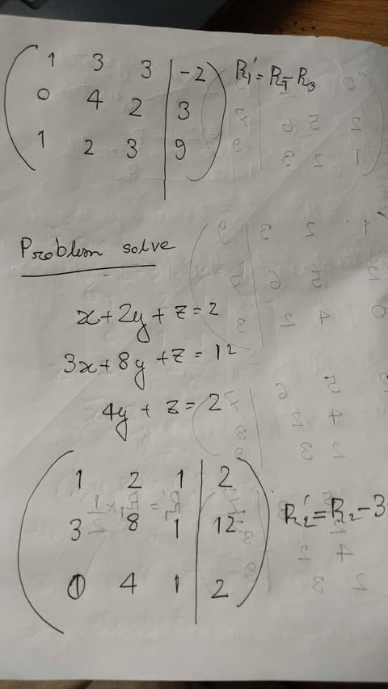

Page 6: elimination steps down to the triangular form.
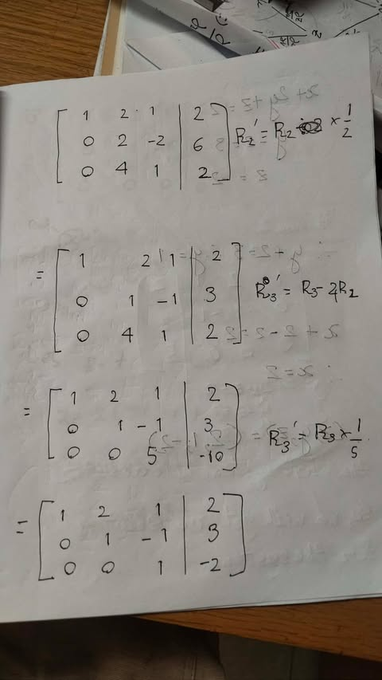

Page 7: back substitution, $(x, y, z) = (2, 1, -2)$.
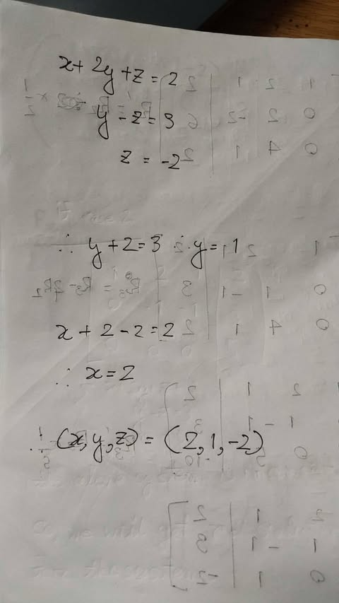

Page 8: Case 2, pivot and free variables, $z = t$.
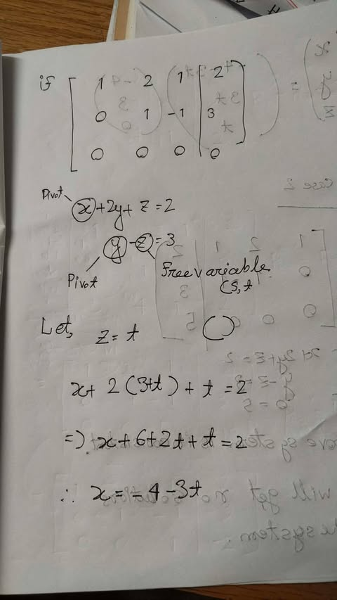

Page 9: general solution in column form, and Case 3 (inconsistent).
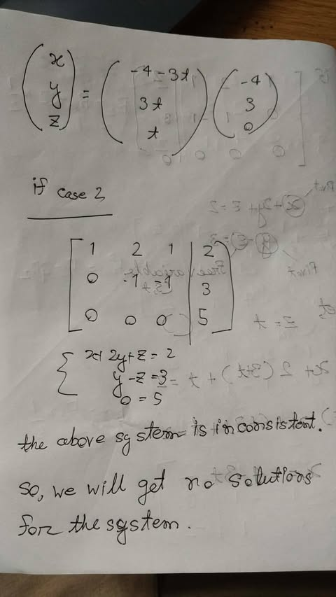

## Textbook reference

See [[Anton and Rorres - Elementary Linear Algebra Book Guide|the main math book guide]] and [[Howard Anton, Chris Rorres - Elementary Linear Algebra with Applications-Wiley (2005).pdf#page=18|section 1.2]] for supporting explanations and extra practice.

---

**Related:** [Lecture 01](2026-10-05%20Lecture%2001%20-%20Systems%20of%20Linear%20Equations.md) · [INDEX](../INDEX.md) · [Formula Sheet](../Formula%20Sheet.md) · [Course Overview](../Course%20Overview.md)
